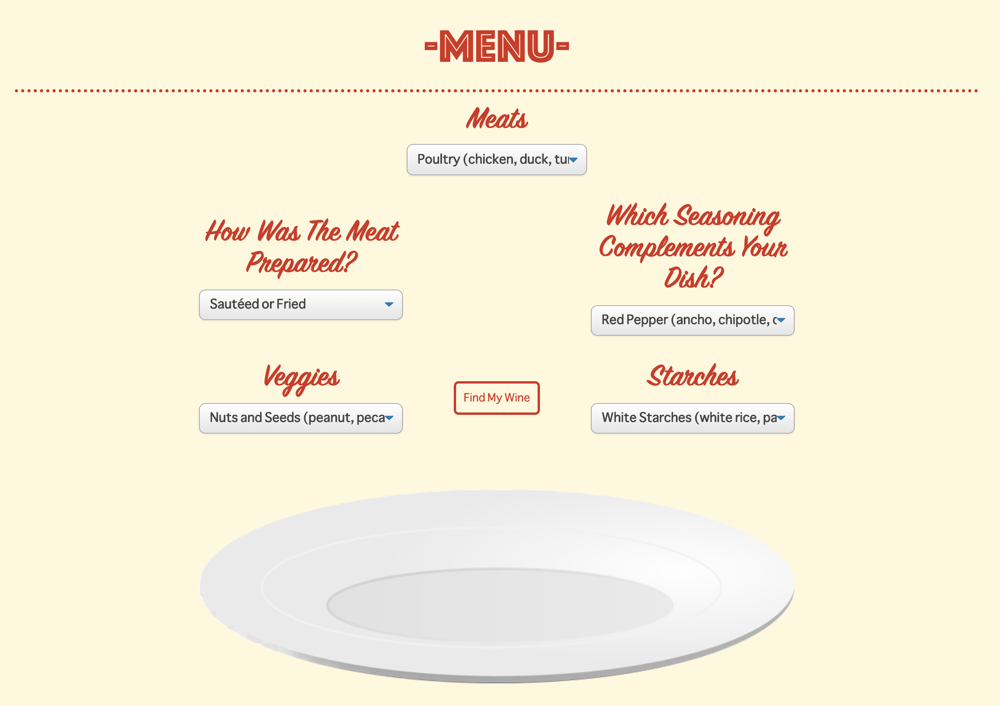
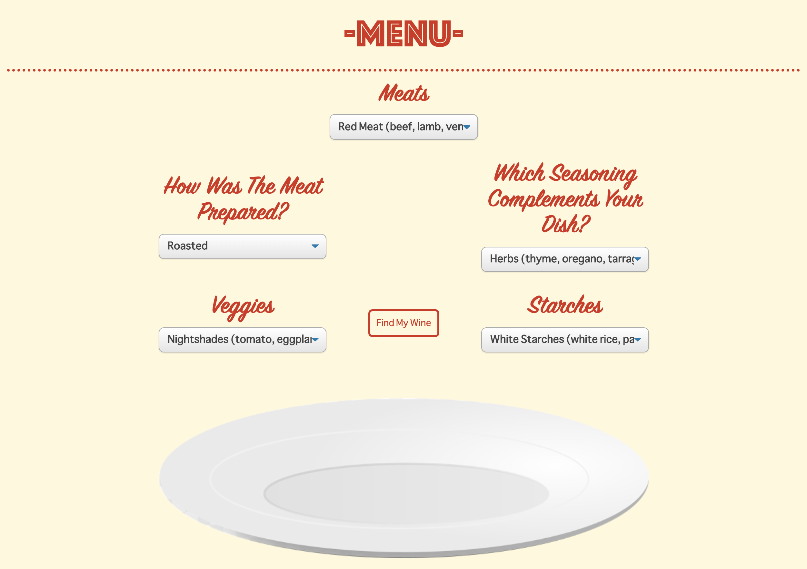

# Winer

[live demo](https://www.winer.life/)

Winer is a project designed to make the perfect wine selection for your next meal. You'll be on your way to discovering
the wide variety of wines out there and, hopefully, a newfound appreciation for this beverage.

## Usage

All you need is a Google account to sign in. After you sign in, you'll have access to our menu and easily select what's
on your dish. Then, we'll provide recommended wines that will pair well with your food.

## Examples

- If you're eating Chicken Pad Thai Noodles with Red Pepper Flakes:
  
  then click on "Find My Wine"

- If you're eating Spaghetti with Meatballs:
  
  then click on "Find My Wine"

## Built With

- [Node.js]
- [React]
- [Express]
- [PostgreSQL]
- [Passport]

## Authors

- **Chris Zosa** - (https://github.com/CZosa)

## License

This project is licensed under the MIT License - see the [LICENSE](LICENSE) file for details
